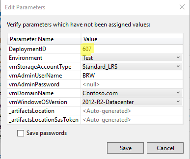

# 3VMDomain
Create a domain with 2 DC's and 1 Member Server using an Azure RM Template

This is the visual studio AzureRM Template project.

When you Deploy, I would simply recommend selecing a unique deployment# that matches the Resource Group Name.

Then optionally choose your environemnt: Dev, Test or Prod.

Then choose your Admin user. You will be prompted for the Password.

Then choose the DomainName.

  
  

This will deploy:

##### DC1, DC2 & MS1

There are currently two documents that are linked to for this deployment
##### This is a second template just to set the DNS on the vNet
"dpSetvNetDNS": "https://raw.githubusercontent.com/brwilkinson/Azure/master/dpSetvNetDNS.json"
##### This is the configuration data
"ConfigData": "https://raw.githubusercontent.com/brwilkinson/Azure/master/ConfigData.psd1"
